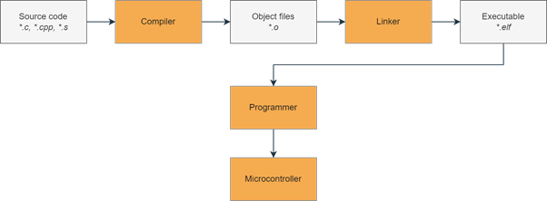
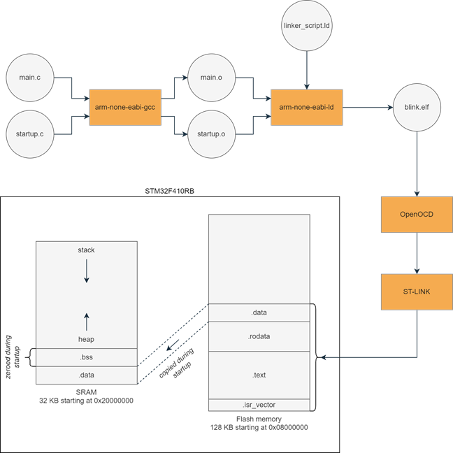

=================
The Build Process
=================

Before diving into the code, let's first review how source code is turned into machine code and uploaded to the microcontroller. The figure below shows a simplified overview of this process:

First, our source files are passed into the (cross-)compiler which turns them into individual object files. The object files are then “linked together” by the linker to form an executable. We then use a programmer to upload the executable to the microcontroller, which then executes our code.
Let's go into a bit more detail with a concrete example. We are going to need the following files:
- a linker script: `linker_script.ld`
- startup code: `startup.c`
- application code: `main.c`

The .c source files are passed to the C compiler (`arm-none-eabi-gcc`) which creates an object file for each source file. These object files are then passed to the linker (`arm-none-eabi-ld`) along with a linker script, telling the linker where each section of the object files should be placed in memory on the microcontroller. The output of the linker is our final executable binary file `blink.elf`. In practice, we will not be invoking `gcc` and `ld` separately, since pre-processing, compiling and linking is all handled by just invoking `gcc`. If we are interested in any of the intermediate output, there are `several command-line options available <https://gcc.gnu.org/onlinedocs/gcc/Overall-Options.html#Overall-Options>`_, for example `-c` to return the compiled object files without linking or `-Wl`,`-Map=filename.map` to instruct the linker to output the memory map file.

After building the executable, we are ready to flash it to the target. Our host PC communicates through OpenOCD with the ST-LINK programmer, which in turn communicates with the microcontroller. Our executable is stored in non-volatile flash memory as specified in the linker script. When the microcontroller boots up, our startup code will ensure that the initialized data section (`.data`) is copied to SRAM and the uninitialized data section (`.bss`) is filled with zeroes. Then the `main()` function is called and our application is running.